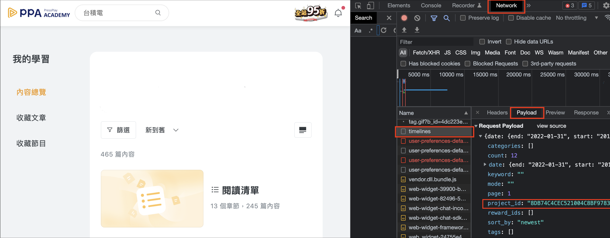
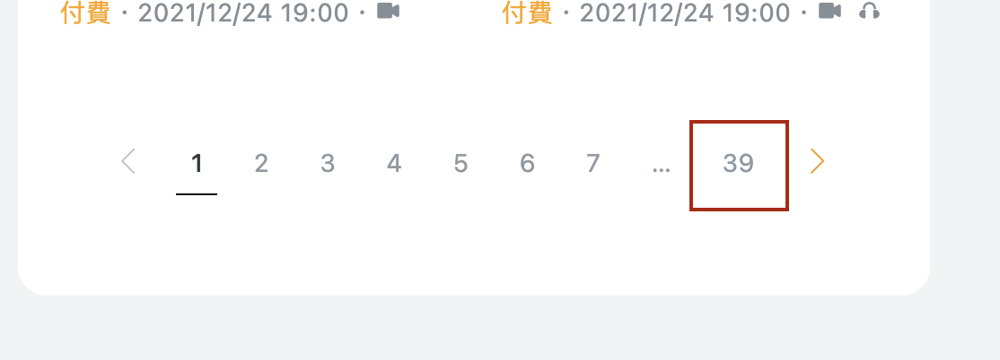

# pressplay crawler
WARNING: All rights retained by the copyright holder. This project only serves for personal use.

## Description
scraping, parsing all article content of a certain pressplay project you subscribe, and storing it into your local directory.

## Prerequisites
you should do sth for "pressplay_crawler.py", before you execute it:
1. replace the headers with your own, inside which is where your account token being located (actually inside cookie).
2. replace project id, which is what you subscribe
3. replace the number of pages (of articles) out there for targeted project
* (Reminder): feel free to change the body payload inside "post" request in the "pressplay_crawler.py", maybe valid time interval varies in the future, then you can just simply copy-paste it as following screeshots shows

### All you need is illustrated below



## How to use
```
$ pip3 install beautifulsoup4
$ python3 pressplay_crawler.py
```
1. for friendly indexing, "id_title.csv" file is created, a list of article pairs with an article-id and article-title for each article.
2. all articles retrieved from pressplay websites will be processed, and stored into a "articleID.html" file for local use.
3. then you can browse them locally as you're doing on pressplay (Or rebuild websites with these html files by yourself)
